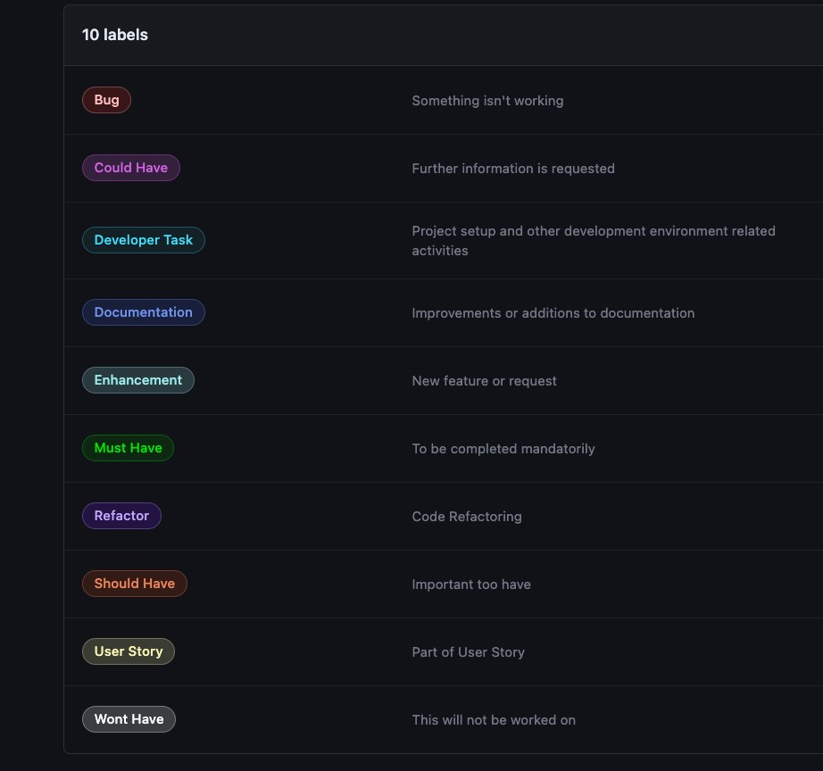
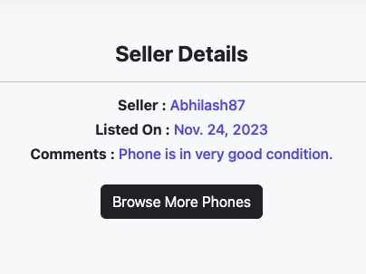
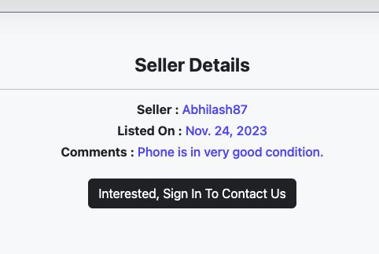
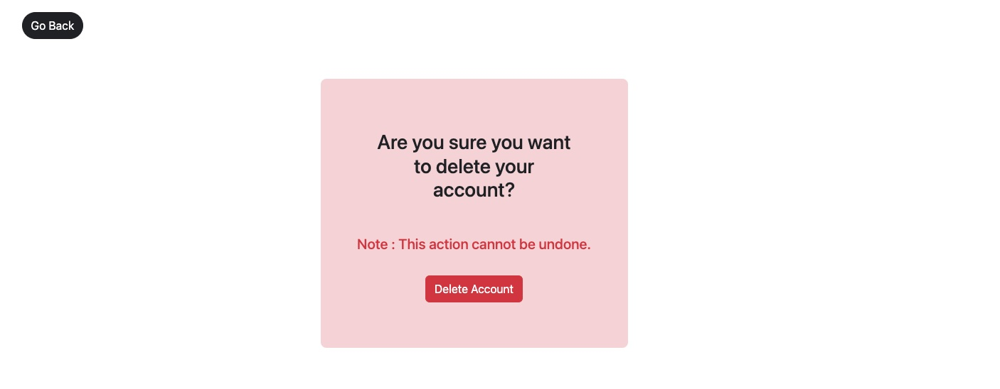

# Mobile Trade

[Link to deployed site](https://mobiletrade-2f5fcc81b06c.herokuapp.com/)

Mobile Trade is a Full-stack E-Commerce website that allows its users to buy and sell mobile phones. This project is made using the Django framework and incorporates other technologies including HTML, CSS, Bootstrap and Javascript. The website enables its users to perform CRUD functionalities post-creation of their individual user accounts. This project is made as a part of Code Institute’s Full Stack Portfolio milestone project.

# Table Of Content

- [User Experience & Design](#user-experience)

  - [Site Goals](#site-goals)
  - [Scope](#scope)
  - [User Stories](#user-stories)
  - [Developer Tasks](#developer-tasks)
  - [Wireframes](#Wireframes)
  - [Database Schema](#Database-Schema)
    - [Models](#models)
  - [Colour Scheme](#colour-scheme)
  - [Fonts](#Fonts)
  - [GitHub and Agile Methodology](#Github-and-Agile-Methodology)
    - [Introduction](#introduction)
    - [EPICS(Milestones)](<#epics(milestones)>)
    - [User Stories issues](<#user-stories-(issues)>)
    - [MoSCoW prioritization](<#moscow-prioritization-(Labels)>)
    - [GitHub Projects](#github-projects)

- [Features](#features)
  - [Navbar](#Navbar)
  - [Footer](#Footer)
  - [Home](#Home)
    - [Hero Section](#hero-section)
    - [New Additions](#new-additions)
    - [Mobile Card](#mobile-card)
  - [Mobiles Page](#mobiles-page)
    - [Search Form](#search-form)
    - [Results Section](#results-section)
  - [Mobile Details Page](#mobile-details-page)
    - [Images](#images)
    - [Mobile Details](#mobile-details)
    - [Seller Details](#seller-details)
    - [Favourites](#favourites)
  - [Profile Page](#profile-page)
  - [Edit Profile Page](#edit-profile-page)
  - [Delete Account Page](#delete-account-page)
  - [My Listings Page](#my-listings-page)
  - [Edit Mobiles Page](#edit-mobiles-page)
  - [Delete Mobile Page](#delete-mobile-page)
  - [My Favourites Page](#my-favourites-page)
  - [Delete Favourite Page](#delete-favourite-page)
  - [Log In Page](#log-in-page)
  - [Register Page](#register-page)
  - [Password Reset Page](#password-reset-page)
  - [Password Reset Sent Page](#password-reset-sent-page)
  - [Password Reset Confirm](#password-reset-confirm-page)
  - [Password Reset Completed](#password-reset-completed)
  - [Error Pages](#error-pages)
- [Future Features](#future-features)
- [Testing](#testing)
- [Bugs](#Bugs)
- [Technologies And Languages](#technologies-and-languages)
  - [Languages](#languages)
  - [Python Modules](#python-modules)
  - [Technologies and Softwares](#technologies-and-softwares)
- [Deployment](#deployment)
  - [Prerequisite](#prerequisite)
  - [Heroku](#heroku)
  - [Creating A Fork](#creating-a-fork)
- [Credits](#credits)
  - [Acknowledgments](#acknowledgments)
  - [Code](#code)
  - [Media](#media)
  - [Conclusion and Summary](#conclusion-and-summary)

## User Experience

### Site Goals

1. To provide users with a platform to buy and sell mobile phones.
2. To provide users understanding of the current second-hand market for mobile phones with exposure to prices and availability.
3. To provide a platform for the users to maintain a record of their own mobile phones which they wish to sell as well as the ones they may be interested in buying.
4. To ensure availability of the website across devices.

### Scope

The project focuses on developing a responsive web app that would allow its users to list, view, manage and delete mobile phones. The app is aimed to be/ provide

- Responsive and User friendly
- Easy to navigate through
- Easy to use and understand
- Essential features like Profile and Listing management
- Notifications for various actions
- User-centric design
- Options to contact/ get in touch for assistance via E-mail, Phone or Social media

### User Stories

1. As a Site User, I can visit the home page of the website,  so that i can know more about the purpose of the website.

2. As a Site User, I want the website to be responsive,  so that I can view it on multiple devices of different resolutions.

3. As a Site User, I can navigate through the website,  so that I can proceed to any section as per my preference.

4. As an Unregistered Site User, I can SignUp/register on the website,  so that I can create a User Account.

5. As a Registered User, I can login using my credentials,  so that I can access my user profile page and other functionalities

6. As a Logged in User, I can view my profile page,  so that I can access all available functionalities for a registered user

7. As a Registered User, I can delete my profile,  so that I can remove all my personal info including my listings and favourites from the website.

8. As a Registered User, I can reset my profile password,  so that I can regain access to my user account if I forget my password.

9. As a Registered User, I can manage my favourite listings,  so that I can Add to, View and Delete them from my favourites list.

10. As a Registered User, I can manage my listings,  so that I can Add to and View products from My Listings.

11. As a Registered User, I can manage my listings,  so that I can Update and Delete items from My Listings.

12. As a Site User, I can see the recent mobile phone additions to website,  so that I know whats newly available.

13. As a Site User, I can visit Listings Page,  so that I can see all the listed mobile phones on the website.

14. As a Site User, I can search for a mobile phone based on Brand, Model, Maximum and Minimum Price,  so that I can find mobile phones as per my preferences.

15. As a Site User, I can view/visit Product Details Page,  so that I can see all details of the product I am interested in.

16. As a Registered Site User, I can email Mobile Trade regarding a listing, so that seller is contacted if I am interested in buying or for any other queries related to phone.

### Developer Tasks

1. Project Design and Installing Django
2. Setting up Database and File storage
3. Initial Deployment on Heroku
4. Testing
5. Documentation

### Wireframes

Wireframes were made with the help of Balsamiq.

- Home

  

- Profile

  

- Mobiles

  

- Mobile Details

  

- Log in

  

- My Listings

  

- My Favourites

  

### Database Schema

#### Models

The Project comprises of below models

1. User

This model is imported from Django Allauth. The predefined fields that were used were username, first name, last name, email, name and password.The User model is associated with the Profile model with one to one relationship and is used for user authentication.

2. Profile

This model handles the user profile details. Autosave is used to create a user profile whenever a new User registers. Auto deletion of user profile happens in the event of user account deletion.

3. Mobile

The mobile model is connected to the User with a Foreign Key: seller. On deletion of user, mobile details are deleted automatically.

4. Favourites

This model saves all favourites associated to a Profile. The model is connected to User and Mobile models (Foreign Keys : seller and mobile. On deletion of either favourites is deleted automatically.

### Colour Scheme

The website incorporates shades of black and grey, with complementary neutrals. This scheme ensures a professional and user-friendly appearance and enhances the visual appeal of the website.

The colour scheme effectively compliments the content of the website without pulling away user attention from them.

### Fonts

The font used in this project is default Oswald, which very well complements the content and design of the website.

### GitHub and Agile Methodology

#### Introduction

This project was developed using agile principles on GitHub. All functions and features were broken down into Issues(User Stories). Depending on their nature Issues were grouped under Milestones (Epics). Each Issue had its acceptance criteria and assigned tasks. Depending on importance and requirement, each Issue was given a Label basis MoSCoW prioritization. The entire development was monitored using a Kanban board available under Projects on GitHub.

#### EPICS (Milestones)

The project was divided into 6 Milestones (Epics). All Issues (User Stories) were initially put under product backlog and moved to their respective Millestones. All new Issues and bugs were added to Product Backlog Milestone

#### User Stories (Issues)

Issues were comprised of User Story and its Acceptance criteria along with relevant Tasks. Issues were also used to create developer tasks.

#### MoSCoW prioritization (Labels)

GitHub's Labels were used to implement MoSCoW Prioritization (Must have, Should have, Could have, and Won't have) of User Stories. Along with these two more Labels Developer Task and Bugs were also used. This helped in categorisation and prioritisation of different Issues.

#### GitHub Projects

GitHub Projects was used to keep track of workflow. This was done with the help of a basic Kanban board which divided the Issues into three different stages of development which were Todo, Doing and Done.

## Features

### Navbar

The Navigation bar was built using Bootstrap and is responsive across devices. It is present on all pages and has a brand name and logo which when clicked redirects the user to the home page. Unauthenticated users of the website will be able to see three links which are Home, Mobiles and Login. For authenticated users, there will be 4 links which are Home, Mobiles, My Profile and Logout. On small devices, user will see a hamburger menu with same options.

### Footer

The footer is common across pages and communicates the Website name, Purpose, Address, Contact details, Social Media links and copyrights.

### Home

#### Hero Section

The Hero section comprises an image of mobile phones and a tagline "Buy and Sell Mobiles" which immediately communicates the purpose of the website to its user. The image and tag perfectly complements the design and the rest of the components on the home page.

#### New Additions

The New Addition section displays the latest four mobiles added to the website. These are displayed using cards.

#### Mobile Card

The mobile card was made with Bootstrap and consists of the mobile phone's Brand name, Model, Image, Price and a Link to go to the mobile details page.

### Mobiles Page

#### Search Form

The search section allows users to filter mobiles based on Brand, Minimum Price and Maximum Price.

#### Results Section

This section displays the results of the search done by the user.

### Mobile Details Page

#### Images

This section displays all images uploaded by the user. If the user has not uploaded any images the section will show the default image.

#### Mobile Details

This section displays mobile specifications provided by the user.

#### Seller Details

This section displays Seller details and the mobile listed date. There is a link that changes as per 3 different scenarios.

1. If an authenticated user visits his listing: Browse More Phones (Redirects to Mobiles Page)

2. If an authenticated user visits another user's listing: Interested? Contact Us (Triggers mailto response to MobileTrade)

3. If unauthenticated user visits : Interested? Sign In to Contact Us (Redirects to login page)

#### Favourites

This link changes as per 4 different scenarios.

1. If an authenticated user visits his listing: Edit Mobile Details (Redirects to Edit Mobile details Page)

2.1 If an authenticated user visits another user's listing: Add to Favourites (Adds mobile to user's favourites Page)

2.2 If mobile is already added to the user's favourites list: Remove From Favourites (Removes mobile from user's favourites Page)

3. If a unauthenticated user visits: Add to Favourites (Redirects to login page)

### Profile Page

The profile page displays details of the user like Name, Email Id, Profile Picture and 4 different links which are.

1. Edit Profile (redirects to profile editing page)
2. My Listings (redirects to user's listing page)
3. My Favourites (redirects to user's favourites page)
4. Delete Account (redirects to user account deletion confirmation page)

### Edit Profile Page

This page allows users to edit their details and remove/upload profile picture.

### Delete Account Page

The page requests the user to confirm the deletion of the account.

### My Listings Page

This page displays mobiles listed by the user in the form of cards that show Brand, Model, Image and three links which are

1. View (Redirects to mobile details page)
2. Edit (Redirects to edit mobile details page)
3. Delete (Redirects to mobile deletion confirmation page)

The page also allows users to add new phones.

### Edit Mobiles Page

The page enables users to edit mobile details and upload images.

### Delete Mobile Page

The page requests the user to confirm the deletion of the selected mobile.

### My Favourites Page

This page displays user's favourite mobiles in the form of cards which show Brand, Model and Image with 2 links which are

1. View (Redirects to mobile details page)
2. Remove (Redirects to favourite deletion confirmation page)

### Delete Favourite Page

The page requests user to confirm removal of selected mobile from favourites list.

### Log In page

The page comprises of login form that allows users to login using a username and password. The page also has links for

1. New User Registration
2. Password Reset

### Register page

This page allows a new user to register on the website by providing their details.

### Password Reset Page

This page requests the user to enter their Email Id so that password reset link and details can be sent.

### Password Reset Sent Page

This page confirms to the user that a password reset link has been sent to their Email ID.

Sample Email :

### Password Reset Confirm

Users are redirected to this page when they click on the link sent to them via Email. On this page, user is asked to enter the password twice and confirm.

### Password Reset Complete

When user confirms their password on the Password reset confirm page they are redirected to this page which confirms that a new password has been set.

### Messages

Notification messages whenever the user performs actions like Log in, Log out, add, edit, delete and unauthenticated requests.

### Error Pages

- Custom template for error 404

- Custom template for error 403

- Custom template for error 500

## Future Features

1. Implement a contact form using which a direct message can be sent to the seller in case a user is interested in buying / has some queries.

2. Add an inbox feature in the user profile for the user to receive/view/send emails from/to other users.

3. Introduce a shopping cart feature and payment gateway for users to make purchases online.

## Testing

Please find attached a detailed [testing report](./TESTING.md)

## Bugs

Below is the list of bugs encountered during development and were fixed.

1. [Deployment Error](https://github.com/users/AbhilashAynipully/projects/3/views/1?pane=issue&itemId=43906187)
2. [Password Reset Mail Error](https://github.com/users/AbhilashAynipully/projects/3/views/1?pane=issue&itemId=45909200)
3. [Default Image Render Error](https://github.com/users/AbhilashAynipully/projects/3/views/1?pane=issue&itemId=45909556)

No unfixed bugs remain

## Technologies And Languages

### Languages

- HTML
- CSS
- JavaScript
- Python
- Bootstrap 5.3.2
- Django 3.2

### Python Modules

- dj-database-url - Allows us to parse the database URL specified in the DATABASE_URL environment variable to a format that works with Django projects.

- django-resized - Assists with resizing images in Django.

- gunicorn - The server that we're going to use to run Django on Heroku.

- dj3-cloudinary-storage - A persistent file store to upload and store images uploaded by users.

- Pillow - Python Imaging Library (PIL) that provides support for handling images of different formats.

- psycopg2 - Psycopg2 is a PostgreSQL adapter for Python with which Django connects to PostgreSQL databases.

### Technologies and Softwares

- [GitHub](https://github.com/) is used to manage and store the code for the project.
- [Git](https://git-scm.com/) version control software to commit and push the code to the GitHub repository.
- [Code Institute Template](https://github.com/Code-Institute-Org/gitpod-full-template) was used as a base template for the project.
- [Google Chrome Lighthouse](https://developers.google.com/web/tools/lighthouse) for performance testing of the deployed website.
- [Google Chrome Developer Tools](https://developer.chrome.com/docs/devtools/overview/) was used for inspecting, testing and checking responsiveness during the development
- [W3C HTML Validator](https://validator.w3.org/) for validating HTML code.
- [W3C CSS Validator](https://jigsaw.w3.org/css-validator/) for validating CSS code
- [Js Hint](https://jshint.com/) for validating JavaScript code.
- [CI Python Linter](https://pep8ci.herokuapp.com/) for validating Python code.

## Deployment

### Prerequisite

1. requirements.txt:
   Contains the list of requirements for the application to run successfully.

2. env.py:
   Contains all credentials that are not to be exposed and are included in .gitignore file.

3. Debug:
   Debug to be turned off by setting its value to false in settings.py

### Heroku

Below are the steps involved in deploying on Heroku considering we have an active Heroku account.

1. Create a new App from dashboard: mobiletrade

2. Setting up Config Vars in settings which involves adding credentials and API keys

   - CLOUDINARY_URL
   - DATABASE_URL
   - EMAIL_HOST_USER
   - EMAIL_HOST_PASSWORD
   - SECRET_KEY

3. Adding python Buildpack

4. Linking GitHub account to Deployment Method under Deploy section.

5. Deploy the Branch and wait for the App to be built.

6. Once the app is built click on view button to lauch the website.

### Creating a fork

1. Navigate to the MobileTrade

2. Click on the fork button present in the top right corner and click Create a fork.

3. Select the main branch for copying.

4. Click on Create a Fork and a new repository will be added to GitHub account.

## Credits

### Acknowledgments

- A big thanks to my mentor Mr Anthony Ugwu for believing in me and allowing me to proceed with the idea.

- I am grateful to Code Intitute's Tutor support team (Oisin, Gemma, Martin, Sarah, John and Roman) for helping me understand different concepts whenever I got stuck.

- "Hello Django" and "I Think Therefore I Blog" walkthrough projects which helped in understanding the basics of Django.

- Thanks to Mosh Hamedani's Ultimate Django online course which I am doing simultaneously I could learn and implement many concepts required for this project.

### Code

- All the steps for project setup and deployment were implemented as per Code Institute's walkthrough projects.

- Most of the HTML and CSS styling were implemented using Bootstrap classes.

- All code for the project including Models and Views was written by me.

### Media

- All mobile listing images were obtained from amazon.co.uk

- Hero Image was obtained from puri.sm website

- The default mobile image was obtained from freepik.com

### Conclusion and Summary

This project involved the use of Django which is a Python based full stack framework and is considered to be one of the best frameworks available today. It was an ideal choice as it supports Database management and HTML template creation along with support for numerous Python modules based on the project.

The MobileTrade project comprises of 2 Apps

1. Users App

This App deals with functions and features related to Users like New user registration, Profile management and Personal Listings management.

2. Mobiles App

This App manages CRUD functionalities related to mobile listings and favourites.

The models in the project are Profile, Mobile and Favourites models which helps in storing all the required data for the proper functioning of the Web App.

Finally, I am grateful to Code Institute for providing me with an opportunity to build this project. This project helped in understanding various concepts involved in Django-based web development. I was able to test my knowledge and understanding of different aspects learned in the last few months of the course. During the entire development process, I was able to improve my problem-solving skills and a deeper level of understanding of Agile-based development process. In future, I hope to develop my skills further by taking up other challenging projects.