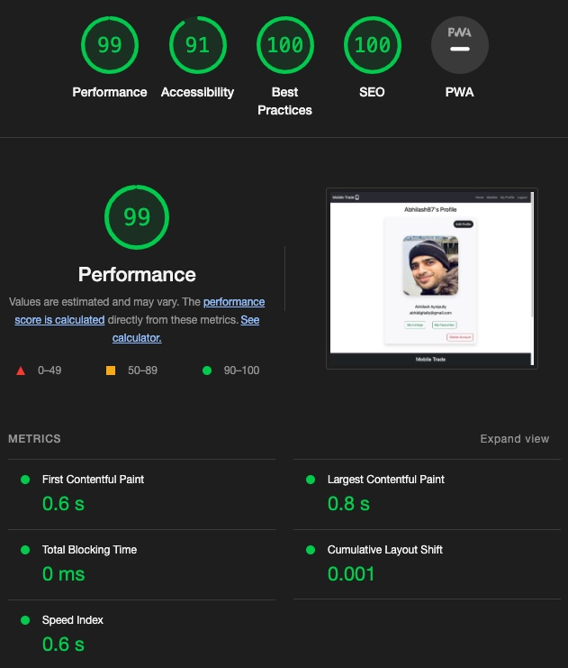

# Testing and Code Validation

The overall testing procedure is divided into below sections

- [Responsiveness and Browser Compatibility](#responsiveness-and-browser-compatibility)
- [Lighthouse Testing](#Lighthouse-testing)
- [Manual Testing](#manual-testing)
- [User Story Testing](#user-story-testing)
- [Code Validation](#code-validation)

## Responsiveness and Browser Compatibility

Responsiveness testing for the website was done during the development phase with the help of Google Chrome Developer Tools. Please find below the result across devices.

| Device              | Screen Size | Responsive | Comments                                          |                                            
| ------------------- | ----------- | ---------- | -------------------------------------------------|
| Samsung Galaxy Fold | 280x653     | YES        | All pages rendered properly without any concerns |                            
| Iphone SE           | 375x667     | YES        | All pages rendered properly without any concerns |                                            
| Ipad Mini           | 768x1024    | YES        | All pages rendered properly without any concerns |                                            
| Surface Pro 7       | 912x1368    | YES        | All pages rendered properly without any concerns |                                            
| Nest Hub Max        | 1280x800    | YES        | All pages rendered properly without any concerns |

The website was tested on Google Chrome, Safari, Firefox, Microsoft Edge for browser compatibility. Please find below the results.

| Browser       | Compatible | Comment                                                                      |
| --------------| ---------- | -----------------------------------------------------------------------------|
| Google Chrome | YES        | All Pages rendered properly with images and the website was fully functional |  
| Safari        | YES        | All Pages rendered properly with images and the website was fully functional |           
| Firefox       | YES        | All Pages rendered properly with images and the website was fully functional |              
| Edge          | YES        | All Pages rendered properly with images and the website was fully functional |     

## Lighthouse

|Page|Lighthouse Report|
|----|-----------------|
|Home Desktop| |
|Home Mobile| |
|Mobiles Desktop| |
|Mobiles Mobile| |
|Login Desktop| |
|Login Mobile| |
|Profile Desktop| |
|Profile Mobile| |
|My Listings Desktop| |
|My Listings mobiles| |
|My Favourites Desktop| |
|My Favourites Mobile| |
|Edit Profile Desktop| |
|Edit Profile Mobile| |
|Edit Mobiles Desktop| |
|Edit Mobile Mobile| |
|Mobile Details Desktop| |
|Mobile Details Mobile| |
|Delete Account Desktop| |
|Delete Account Mobile| |
|Delete Mobile Desktop| |
|Delete Mobile Mobile| |
|Remove Favourites Desktop| |
|Remove Favourites Mobile| |
|Add Mobile Desktop| |
|Add Mobile Mobile| |
|Register Account Desktop| |
|Register Account Mobile| |
|Password Reset Desktop| |
|Password Reset Mobile| |
