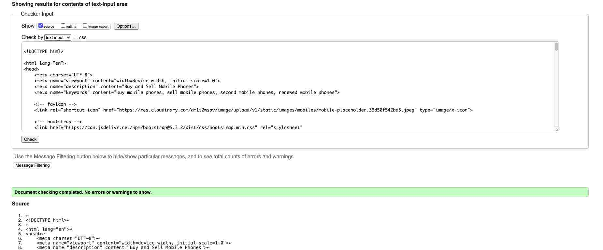
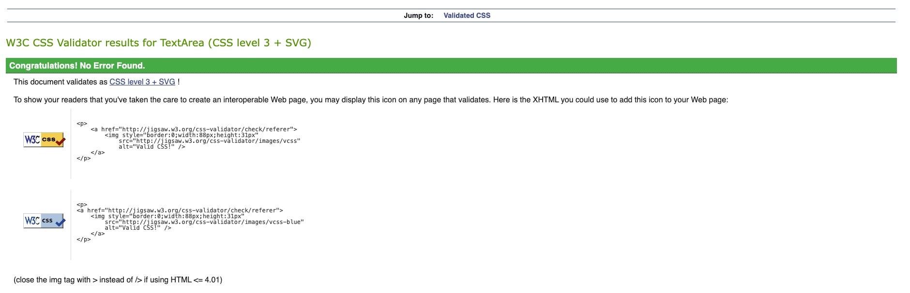

# Testing and Code Validation

The overall testing procedure is divided into below sections

- [Responsiveness and Browser Compatibility](#responsiveness-and-browser-compatibility)
- [Lighthouse Testing](#Lighthouse-testing)
- [Manual Testing](#manual-testing)
- [User Story Testing](#user-story-testing)
- [Code Validation](#code-validation)

## Responsiveness and Browser Compatibility

Responsiveness testing for the website was done during the development phase with the help of Google Chrome Developer Tools. Please find below the result across devices.

| Device              | Screen Size | Responsive | Comments                                          |                                            
| ------------------- | ----------- | ---------- | -------------------------------------------------|
| Samsung Galaxy Fold | 280x653     | YES        | All pages rendered properly without any concerns |                            
| Iphone SE           | 375x667     | YES        | All pages rendered properly without any concerns |                                            
| Ipad Mini           | 768x1024    | YES        | All pages rendered properly without any concerns |                                            
| Surface Pro 7       | 912x1368    | YES        | All pages rendered properly without any concerns |                                            
| Nest Hub Max        | 1280x800    | YES        | All pages rendered properly without any concerns |

The website was tested on Google Chrome, Safari, Firefox, Microsoft Edge for browser compatibility. Please find below the results.

| Browser       | Compatible | Comment                                                                      |
| --------------| ---------- | -----------------------------------------------------------------------------|
| Google Chrome | YES        | All Pages rendered properly with images and the website was fully functional |  
| Safari        | YES        | All Pages rendered properly with images and the website was fully functional |           
| Firefox       | YES        | All Pages rendered properly with images and the website was fully functional |              
| Edge          | YES        | All Pages rendered properly with images and the website was fully functional |     

## Lighthouse Testing

|Page|Lighthouse Report|
|----|-----------------|
|Home Desktop| |
|Home Mobile| |
|Mobiles Desktop| |
|Mobiles Mobile| |
|Login Desktop| |
|Login Mobile| |
|Profile Desktop| |
|Profile Mobile| |
|My Listings Desktop| |
|My Listings mobiles| |
|My Favourites Desktop| |
|My Favourites Mobile| |
|Edit Profile Desktop| |
|Edit Profile Mobile| |
|Edit Mobiles Desktop| |
|Edit Mobile Mobile| |
|Mobile Details Desktop| |
|Mobile Details Mobile| |
|Delete Account Desktop| |
|Delete Account Mobile| |
|Delete Mobile Desktop| |
|Delete Mobile Mobile| |
|Remove Favourites Desktop| |
|Remove Favourites Mobile| |
|Add Mobile Desktop| |
|Add Mobile Mobile| |
|Register Account Desktop| |
|Register Account Mobile| |
|Password Reset Desktop| |
|Password Reset Mobile| |

## Manual Testing

Please find below details of all manual testing done to ensure proper functionality of the website

### Navbar

- Navbar is present on all pages and comprises of brand name and logo. When clicked it does redirect the user to the home page.
- For an unauthenticated user, three links appear which are Home, Mobiles - and Login and are functional.
- For a signed-in user, four options appear which are Home, Mobiles, My Profile and Logout. All links are functional
- All style elements are working properly

### Footer

- Footer is present on all pages and the social media links do open the sites in new tabs.
- All style elements are working properly

### Home Page

- Navbar is present, functional and shows the right links depending upon the user's authentication status.
- Hero Image is loading along with cover text across devices and browsers.
- The new additions section displays the recent 4 listings in the form of cards which does display the brand name, model, image, price and link to go to the details page. On clicking the link user is redirected to the details page.
- In the absence of image default image is getting displayed for mobiles on cards.
- The browse more phones link that is present below the new additions section when clicked does redirect the user to the mobiles page.
- Footer is present and functional.
- All style elements are working properly

### Mobiles Page

- Navbar is present, functional and shows the right links depending upon the user's authentication status.
- All mobiles are being displayed under the results section when the page loads and no search is done.
- Search form loads without any issues across devices.
- The Brand drop down menu on search form does show all the options available to choose from. It filters and shows mobiles belonging to the selected brand under results.
- Both minimum and maximum price input fields are only accepting numbers in the range of 1 to 10000 and are producing results as per the input values.
- In the results section mobiles are displayed in the form of cards which display the brand name, model, image, price and link to go to the details page. On clicking the link user is redirected to the details page.
- In the absence of an image default image is displayed for mobiles on cards.
- The Back to Search link present below the results section is working and brings the user back to the search form on top.
- Footer is present and functional.
- All style elements are working properly

### Login Page

- Navbar is present, functional and shows the right links depending upon the user's authentication status.
- The Login form is loading with input fields for entering username and password. In case of invalid/no credentials, an error message is displayed on top just below the navbar.
- Forgot password and Signup links are working redirecting user to respective pages.
- On entering valid details user is logged in and redirected to the home page and navbar elements are getting updated.
- Footer is present and functional.
- All style elements are working properly

### Register Page

- Navbar is present, functional and shows the right links depending upon the user's authentication status.
- Registration form is getting rendered with all fields and respective labels.
- Form validation is working and error hints are displayed in red coloured text.
- In the event a user enters an existing username the same is being notified to the user.
- For all errors, a common error message appears below the navbar requesting the user to go through the error hints appearing on the form.
- On successful registration user is logged in and redirected to the home page, A message saying "Registration Successful" appears below the navbar.
- The login page link present below the submit button does redirect to login page. Existing account holder can click on it to move to the login page.
- Footer is present and functional.
- All style elements are working properly.

### Password Reset

- Navbar is present, functional and shows the right links depending upon the user's authentication status.
- Password reset form rendered with an input field for the user to enter their Email Id.
- Email Input validation is working.
- On successful submit user is getting redirected to the password reset email sent page.
- Footer is present and functional.
- All style elements are working properly.

### Password Reset Mail Sent

- Navbar is present, functional and shows the right links depending upon the user's authentication status.
- The password reset email sent confirmation message is being rendered properly.
- Footer is present and functional.
- All style elements are working properly.

### Password Confirm

- Navbar is present, functional and shows the right links depending upon the user's authentication status.
- On clicking the password reset link received over email the password confirm page is being rendered on a new tab in the browser.
- The password confirm form is displayed and form validation is working for proper input.
- On successful submission password is reset and the user is redirected to confirmation page.
- Footer is present and functional.
- All style elements are working properly

### Password Reset Confirmation

- Navbar is present, functional and shows the right links depending upon the user's authentication status.
- The password reset confirmation message is being rendered properly informing the user about the password change.
- Footer is present and functional.
- All style elements are working properly

### Profile Page

- Navbar is present, functional and shows the right links depending upon the user's authentication status.
- When an authenticated user clicks on my profile link profile page is displayed.
- Username, name, email and profile picture are displayed , in the absence of a profile picture default picture is displayed.
- All 4 links My Listings, My Favourites, Delete Account and Edit Profile are working and redirecting to respective pages.
- Footer is present and functional.
- All style elements are working properly

### My Listings

- Navbar is present, functional and shows the right links depending upon the user's authentication status.
- When a user clicks on the My Listing link on the profile page the My listing page is rendered.
- The Back button present on top is working and redirects the user back to the profile page.
- User's listed mobiles are being displayed in the form of cards.
- Cards display brand name, model, image, price and 3 different links to go to the details page, the delete mobile page and the edit mobile details page. On clicking the links user is redirected to the respective pages.
- In the absence of listing "Your currently have no Mobiles added." message is displayed.
- The Add Mobile link present at the bottom of my listings section is working and redirects to the mobile addition page.
- Footer is present and functional.
- All style elements are working properly

### My Favourites

- Navbar is present, functional and shows the right links depending upon the user's the authentication status.
- When a user clicks on My Favourites link on the profile page My Favourites page is rendered.
- The Back button present on top is working and redirects user back to profile page.
- User's favourite mobiles are being displayed in the form of cards.
- Cards do display brand name, model, image, price and links to go to the details page and the remove favourite page. On clicking the link user is redirected to the details page and remove favourite page.
- In the absence of any favourites "You currently have no Favourites added." message is displayed.
- The Browse More link present at the bottom of the favourites section is working and redirects to the mobiles pages.
- Footer is present and functional.
- All style elements are working properly

### Edit Listing

- Navbar is present, functional and shows the right links depending upon the user's authentication status.
- When a user clicks on the edit link present on a mobile card on the my listing page,the edit mobile page for same listing is rendered.
- The Back button present on top is working and redirects user back to the my listings page.
- The User is displayed a prepopulated form with existing details.
- All the prepopulated input fields are editable.
- Form validation is working and the user is getting prompted if essential fields are being left blank.
- On clicking submit forms is getting processed and details are getting updated. User is redirected to the home page and a notification message does appears on top confirming the change.
- Footer is present and functional.
- All style elements are working properly

### Remove Favourites

- Navbar is present, functional and shows the right links depending upon the user's authentication status.
- On clicking the Remove link present on the favourites card user is redirected to the remove favourites page.
- The Back button present on top is working and redirects the user back to my favourites page.
- Delete Favourite confirmation section does appear with awarning message and a remove button.
- On clicking remove mobile is getting removed from user'r favourites list. The User is redirected to the home page with a confirmation message regarding the removal of favourite.
- Footer is present and functional.
- All style elements are working properly

### Mobile Details

- Navbar is present, functional and shows the right links depending upon the user's authentication status.
- The Back button present on top is working and redirects the user back to the previous page that the user has navigated from.
- Mobile Brand name and model appear on top.
- All images uploaded by the user do appear in the images section, default image appears in case the user has not uploaded any image.
- All mobile details are rendered under the mobile details section, in the absence of details "Not Available" comment does appear.
- Seller's username, mobile listing date and seller's comments appear under the seller details section, in the absence of the seller's comment "Not Available" appears instead.
- The Link in the seller's section is getting updated based on the user's authentication status and the listing visited
  - If an authenticated user visits his listing: Browse More Phones and does redirect to Mobiles Page if clicked
  - If an authenticated user visits another user's listing: Interested? Contact Us and does trigger a mailto response to MobileTrade if clicked. The email is addressed correctly with the correct subject line.
  - If an unauthenticated user visits : Interested? Sign In to Contact Us and Redirects to the login page if clicked
- Add to Favourite link present below seller section is getting updated based on the user's authentication status and listing being visited.
  - If an authenticated user visits his listing: Edit Mobile Details and redirects to Edit Mobile details Page when clicked.
  - If an authenticated user visits another user's listing: Add to Favourites and add mobile to user's favourites list when clicked.
  - If mobile is already added to the user's favourites list: Remove From Favourites and remove mobile from user's favourites list when clicked.
  - If an unauthenticated user visits: Add to Favourites and redirects the user to the login page if clicked.
- Footer is present and functional.
- All style elements are working properly

### Delete Account

- Navbar is present, functional and shows the right links depending upon the user's authentication status.
- On clicking the Delete Account link present on the profile page user is redirected to the delete account page.
- The Back button present on top is working and redirects the user back to the profile page.
- Delete Account confirmation section does appear with a warning message and a Delete Account button.
- On clicking delete account account is deleted and the user is redirected to the home page with a confirmation message on top regarding account deletion. The navbar option changes and the user will only see home, mobiles and login options.
- User credentials are no longer valid.
- Footer is present and functional.
- All style elements are working properly

### Delete Mobile

- Navbar is present, functional and shows the right links depending upon user's authentication status.
- On clicking the Delete link present on the my mobile card the user is redirected to the delete mobile page.
- The Back button present on top is working and redirects the user back to the my mobiles page.
- Delete Mobile confirmation section does appear with a warning message and a Delete mobile button.
- On clicking Delete Mobile, mobile records are removed from the database and the listing doesn't appear on my listings. The user is redirected to the home page with a confirmation message about the mobile deletion.
- Footer is present and functional.
- All style elements are working properly

### Edit Profile

- Navbar is present, functional and shows the right links depending upon the user's authentication status.
- When the user clicks on the edit profile link present on the profile page,the  update profile page is rendered.
- The Back button present on top is working and redirects the user back to the my listings page.
- The user is displayed a prepopulated form with existing details.
- All the prepopulated input fields are editable.
- Form validation is working and the user is getting prompted for invalid entries.
- On clicking submit, form is getting processed and user details are getting updated. The User is redirected to the home page and a notification message do appear on top confirming the change.
- Footer is present and functional.
- All style elements are working properly

### Error Pages

- Navbar is present, functional and shows the right links depending upon the user's authentication status.
- Error 403 and Error 500 pages were tested using unauthenticated URL and invalid code. Custom Error pages are working.
- Footer is present and functional.
- All style elements are working properly

## User Story Testing

|User Story| Comments|
|----------| --------|
|1. As a Site User, I can visit the home page of the website,  so that i can know more about the purpose of the website.| All Acceptance criteria and tasks captured in Issues were met|
|2. As a Site User, I want the website to be responsive,  so that I can view it on multiple devices of different resolutions.| All Acceptance criteria and tasks captured in Issues were met|
|3. As a Site User, I can navigate through the website,  so that I can proceed to any section as per my preference.| All Acceptance criteria and tasks captured in Issues were met|
|4. As an Unregistered Site User, I can SignUp/register on the website,  so that I can create a User Account.| All Acceptance criteria and tasks captured in Issues were met|
|5. As a Registered User, I can login using my credentials,  so that I can access my user profile page and other functionalities.| All Acceptance criteria and tasks captured in Issues were met|
|6. As a Logged in User, I can view my profile page,  so that I can access all available functionalities for a registered user.| All Acceptance criteria and tasks captured in Issues were met|
|7. As a Registered User, I can delete my profile,  so that I can remove all my personal info including my listings and favourites from the website.| All Acceptance criteria and tasks captured in Issues were met|
|8. As a Registered User, I can reset my profile password,  so that I can regain access to my user account if I forget my password.| All Acceptance criteria and tasks captured in Issues were met|
|9. As a Registered User, I can manage my favourite listings,  so that I can Add to, View and Delete them from my favourites list.| All Acceptance criteria and tasks captured in Issues were met|
|10. As a Registered User, I can manage my listings,  so that I can Add to and View products from My Listings.| All Acceptance criteria and tasks captured in Issues were met|
|11. As a Registered User, I can manage my listings,  so that I can Update and Delete items from My Listings.| All Acceptance criteria and tasks captured in Issues were met|
|12. As a Site User, I can see the recent mobile phone additions to website,  so that I know whats newly available.| All Acceptance criteria and tasks captured in Issues were met|
|13. As a Site User, I can visit Listings Page,  so that I can see all the listed mobile phones on the website.| All Acceptance criteria and tasks captured in Issues were met|
|14. As a Site User, I can search for a mobile phone based on Brand, Model, Maximum and Minimum Price,  so that I can find mobile phones as per my preferences.| All Acceptance criteria and tasks captured in Issues were met|
|15. As a Site User, I can view/visit Product Details Page,  so that I can see all details of the product I am interested in.| All Acceptance criteria and tasks captured in Issues were met|
|16. As a Registered Site User, I can email Mobile Trade regarding a listing, so that seller is contacted if I am interested in buying or for any other queries related to phone.| All Acceptance criteria and tasks captured in Issues were met|

## Code Validation

### HTML

Please find below HTML validation report using W3C validator.

|Page|Report|Status|
|----|------|------|
| Home | | Pass |
| Mobiles | | Pass |
| Login | | Pass |
| Profile | | Pass |
| Register | | Pass |
| Password Reset Form| | Pass |
| Password Mail Sent| | Pass |
| Password Confirm| | Pass |
| Password Reset Confirmation| | Pass |
| My Listings| | Pass |
| My Favourites| | Pass |
| Profile Update| | Pass |
| Delete Account| | Pass |
| Delete Mobile| | Pass |
| Remove Favourites| | Pass |
| Add Mobiles| | Pass |
| Mobile Details| | Pass |
| Edit Mobile| | Pass |
| Error 404| | Pass |
| Error 403| | Pass |
| Error 500| | Pass |

### CSS

Please find below stylesheet validation report using jigsaw.w3.org

|Page|Report|Status|
|----|------|------|
|Stylesheet | | Pass |

### Python

Please find below python code validation report using PEP8 Python Validator 

#### mobiletrade (main project)
|Page|Report|Status|
|----|------|------|
|url.py | | Pass |
|views.py | | Pass |
|settings.py | | Pass |

#### mobiles App
|Page|Report|Status|
|----|------|------|
| views.py| | Pass |
| admin.py| | Pass |
| apps.py| | Pass |
| choices.py| | Pass |
| forms.py| | Pass |
| models.py| | Pass |
| tool.py| | Pass |
| urls.py| | Pass |

#### users App
|Page|Report|Status|
|----|------|------|
| admin.py| | Pass |
| forms.py| | Pass |
| models.py| | Pass |
| urls.py| | Pass |
| views.py| | Pass |